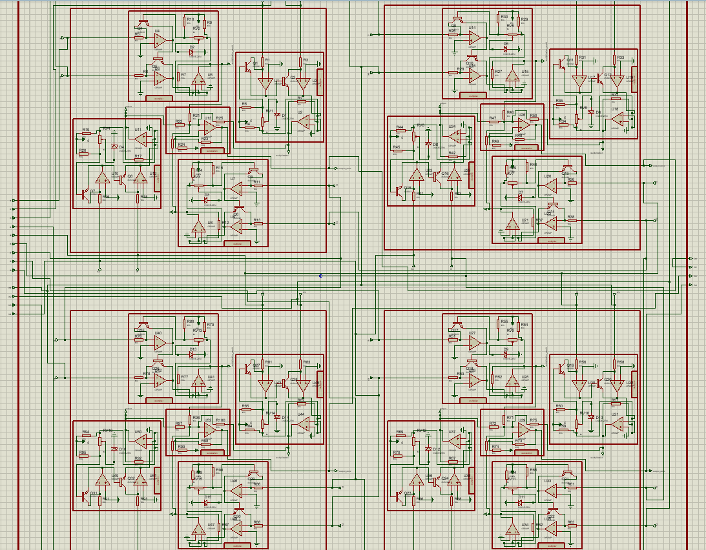

## Implementation of convolution ( 2x2, 3x3 image) with kernel of size 2x2 for here as an example used [[1,0],[0,1]] using opamp circuit.

## The input.txt contains randomly generated image matrix and output.txt has the value of simplified convolutional circui i.e. 2x2 size.

## The complete circuiut diagram is given below

### INPUT: 
### IMAGE: I1,I2,I3,I4,I6,I7,I8,I9
### KERNEL: K1,K2,K3,K4
### OUTPUT: O1,O2,O3,O4